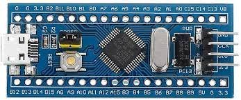

# FreeRTOS example for STM32F030C8T6 based Bluepill board

The STM32F030C8T6 based version of the classic Bluepill board can be found here: [https://www.aliexpress.com/item/1005005481157931.html](https://www.aliexpress.com/item/1005005481157931.html)

The STM32F030C8T6 is a low-cost MCU with a 48MHz Cortex-M0 with 64kB flash memory and 8kB on-chip RAM.

This FreeRTOS demo is based on the STM32F0 FreeRTOS template found here: [https://github.com/nohous/stm32f0-freertos-template.git](https://github.com/nohous/stm32f0-freertos-template.git)

What is changed:

- Adapted to STM32F030x8:
    - Updated linker file
    - Clock setup to use external 8MHz crystal
- LED pin set to PORTC PIN13
- Changed to using dynamic create functions to demonstrate dynamic memory
- Queue demonstration by sending LED on/off times from another task via a FreeRTOS queue
